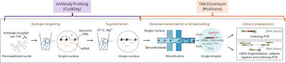
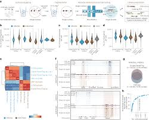

# Droplet Paired Tag

**By Asees Aulakh, Jennifer Kwok, Peter Wang**

------------------------------------------------------------------------

## Introduction & Background

Droplet Paired Tag combines two very powerful tools: cell expression
levels and chromatin markers. Before, scientists would use scRNA-seq to
find cell expression levels and ChIP-seq to measure the chromatin state
separately. This created a large gap of information. While we could
determine which genes were turned on and which regulatory marks were
present on chromatin, it was difficult to directly understand how a
histone modification drives gene expression in a specific cell type.
Droplet Paired Tag fixes this problem by combining both RNA and
chromatin profiling so researchers can understand how cells respond to
signals, differentiate, or become dysfunctional in disease. This allows
scientists to ask questions such as which chromatin states directly
correspond to transcriptional activation and how specific histone
modifications change gene activity.

The first method to combine scRNA-seq and ChIP-seq into a single
workflow was a tool called Paired Tag. This was a major breakthrough
because it allowed researchers to directly connect regulatory elements
with gene activity in the same single cell. However, Paired Tag had
several limitations. The workflow required multiple days, had low
throughput, and contained complex steps that made it difficult to
reproduce consistently. As a result, many labs could not easily adopt
the method.

These challenges led to the development of Droplet Paired Tag. This
improved workflow condensed the barcoding procedure into a single step,
shortened the experimental timeline, and added microfluidic droplets to
drastically increase scalability. Throughput increased from only
hundreds of cells to over 10,000 cells at once. Droplet Paired Tag keeps
the core benefit of Paired Tag---simultaneous measurement of gene
expression and histone modifications---while removing many technical
barriers. As a result, multimodal single-cell analysis has become far
more powerful and accessible.

------------------------------------------------------------------------

## Workflow

### Wet Lab

The first step in Droplet Paired Tag is preparing nuclei for barcoding.
Cells are permeabilized so the nucleus becomes accessible. Once the
nuclei are isolated, antibodies that recognize specific histone
modifications are introduced. For example, the histone mark H3K27ac,
which indicates active enhancers and promoters, is detected using
antibodies that bind only at sites where this modification is present.
These antibodies guide a transposase enzyme that cuts DNA and inserts
short adapter sequences at antibody-bound locations. This selectively
tags chromatin fragments that carry the desired histone modification.

At the same time, the nucleus is lysed to a degree that allows mRNA to
be released. This results in each nucleus containing both tagged
chromatin fragments and free mRNA molecules. The chromatin fragments are
now ready for downstream barcoding.

The next stage is the droplet step. Nuclei are paired with barcoded gel
beads inside a microfluidic device. Each droplet contains one nucleus
and one bead coated with oligonucleotides that share a unique cell
barcode. Inside the droplet, mRNA is reverse transcribed into cDNA,
which attaches to primers on the bead carrying that barcode. As a
result, all transcripts from the same nucleus share a common barcode.
The chromatin fragments, which already contain sequencing adapters from
the transposase step, also acquire the same barcode. When droplets are
broken open, researchers obtain barcoded cDNA and barcoded chromatin
fragments. These form separate sequencing libraries, but because they
share a matching barcode, RNA and chromatin information can be linked
back to the same single cell.

------------------------------------------------------------------------

## Software & Tools

 

### Seurat

Seurat is an R package originally developed for analyzing single-cell
RNA-seq data. It provides tools for normalization, clustering,
dimensionality reduction, and visualization. Droplet Paired Tag
generates thousands of paired single-cell RNA and chromatin profiles
that must be analyzed together. Seurat provides the core framework for
clustering cells, identifying cell types, and visualizing
transcriptional states. By integrating Seurat with Signac, researchers
can correlate gene expression with chromatin features in the same single
cell.

### Signac

Signac is an R package specifically designed for analyzing single-cell
chromatin data such as scATAC-seq, CUT&Tag, Paired Tag, and Droplet
Paired Tag. Prior to Signac, there was no standardized pipeline for
processing and analyzing single-cell chromatin data. Signac was
developed in 2021 by Tim Stuart and colleagues to address this
challenge. It works alongside Seurat to enable full multimodal
integration of RNA and chromatin data within one unified model. Signac
provides the computational structure needed to process the chromatin
side of Droplet Paired Tag datasets.

### Seurat and Signac Workflow

**Input Files:** Droplet Paired Tag produces paired single-cell RNA-seq
matrices and chromatin fragment datasets. Each chromatin fragment
includes a barcode that identifies the cell of origin.

**Data Organization:** The chromatin fragments are loaded into Signac
and stored within a ChromatinAssay object inside a Seurat object. This
structure enables joint analysis of chromatin and RNA.

**Peak Identification:** Regions of enriched chromatin signal, called
peaks, are identified. A cell-by-peak matrix is constructed where each
value represents the number of fragments overlapping each peak per cell.

**Quality Filtering:** Cells are filtered based on quality metrics such
as transcription start site enrichment, nucleosome signal, and fragment
length distribution to remove low-quality nuclei.

**Normalization and Dimensionality Reduction:** The peak matrix is
normalized using TF-IDF, followed by latent semantic indexing (LSI) to
reduce dimensionality and highlight major drivers of chromatin
variability.

**Cell Type Identification:** Cells are clustered based on chromatin
profiles and labeled using canonical marker genes, gene activity
predictions, or paired RNA data.

**Motif and Regulatory Analysis:** Signac performs transcription factor
motif enrichment, footprinting, and peak-to-gene linkage analysis to
infer regulatory mechanisms.

**Multimodal Integration:** Chromatin and RNA data are jointly analyzed
within Seurat to link regulatory elements directly to gene expression.

------------------------------------------------------------------------

## Importance & Conclusion

Droplet Paired Tag is a major advancement in bioinformatics and RNA
sequencing because it allows researchers to measure both gene expression
and chromatin modifications within the same single cell. This provides a
much clearer and more realistic picture of how genes are regulated
inside biological systems. By directly linking histone modifications to
transcriptional output, scientists can better understand how cells
develop, specialize, and respond to environmental signals.

This technology is particularly powerful for studying disease, since
many disorders arise from changes in gene regulation rather than
mutations in DNA sequence. Droplet Paired Tag identifies which cell
types are affected and reveals how abnormal chromatin states lead to
disrupted gene expression. This insight can guide the development of
targeted therapies.

Seurat and Signac make it possible to manage and interpret the massive
datasets produced by Droplet Paired Tag. These tools organize cells,
identify regulatory elements, and link chromatin structure to
transcriptional programs. Together, Droplet Paired Tag and its
computational framework provide a powerful platform to explore cell
identity, disease mechanisms, and future therapeutic strategies.

------------------------------------------------------------------------

## Sources

Stuart, Tim, et al. "Single-Cell Chromatin State Analysis with Signac."
*Nature Methods*, Nov. 2021.\
https://pmc.ncbi.nlm.nih.gov/articles/PMC9255697/

Xie, Yang, et al. "Droplet-Based Single-Cell Joint Profiling of Histone
Modifications and Transcriptomes." *Nature Structural & Molecular
Biology*, Oct. 2023.\
https://pmc.ncbi.nlm.nih.gov/articles/PMC10584685/
